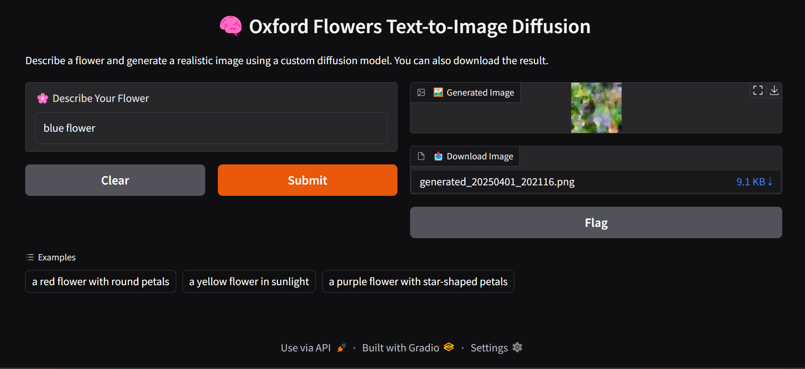

# Text-to-Image Diffusion Model

This project showcases a custom-built **text-to-image diffusion model** trained to generate realistic images of flowers from natural language prompts. Inspired by the principles of denoising diffusion probabilistic models (DDPM), this model was trained on synthetic captioned flower images derived from the Oxford 102 Flowers dataset.

Deployed with a beautiful **Gradio interface**, users can type a flower description and instantly generate a relevant image — with the option to download it.

---

## Features

- Built-from-scratch conditional **U-Net-based diffusion model**
- Integrated **text encoder (GRU + embedding)**
- Simple **synthetic captioning** without requiring external datasets
- Fast inference with **reverse diffusion**
- Interactive **Gradio app with download option**
- Deployable on Hugging Face Spaces or locally via Python

---

## Model Architecture

- **Text Encoder**: Embedding + GRU → condition vector  
- **Conditional U-Net**: Image + text condition concatenated in channel space  
- **Diffusion**: Forward noise scheduling + reverse sampling  
- **Loss**: Mean Squared Error (MSE) between predicted and true noise

---

## Installation

> Clone this repo or use it on Hugging Face Spaces directly.

**Install dependencies**
```bash
pip install torch torchvision gradio nltk
```
**Download NLTK Tokenizer**
```python
import nltk
nltk.download('punkt')
```
**Run locally**
```python
python app.py
```
Then open the Gradio UI in your browser and type a prompt like: `a purple flower with star-shaped petals.`

---

## Project Structure
```bash
├── app.py # Main Gradio app + model definition 
├── requirements.txt # Dependencies 
├── README.md # Project description
├── image_generator_gan.ipynb # colab notebook
└── images/ # Generated images (downloadable)
```
---

## Gradio UI Design


---

## Deploy to Hugging Face Spaces

1. Create a new Space (SDK: **Gradio**) from [https://huggingface.co/new-space](https://huggingface.co/new-space)
2. Upload the following files:
    - `app.py`
    - `requirements.txt`
    - `README.md`
3. (Optional) Add your model weights or training code if applicable
4. Once deployed, the app will be publicly accessible at:

---

## License
This project is licensed under [MIT License](https://github.com/veydantkatyal/image-generator-gan/blob/main/LICENSE)
